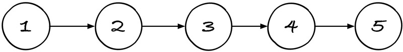
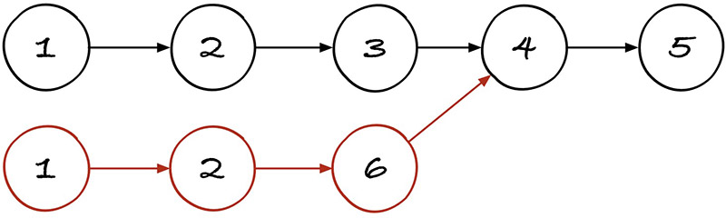
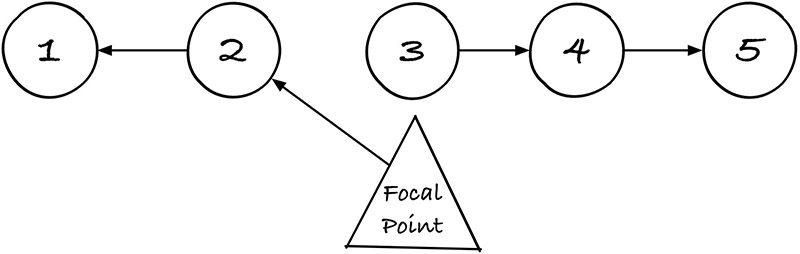
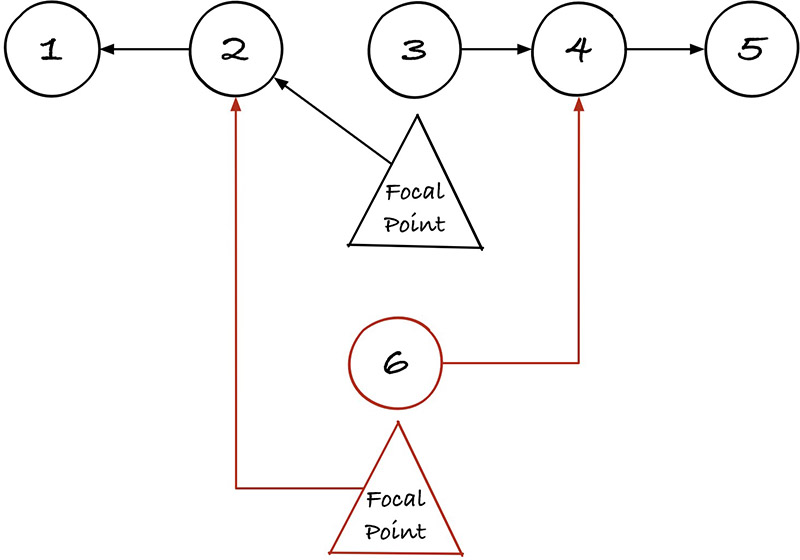

# Zippers

An implementation of immutable Huet zippered linked lists: [https://en.wikipedia.org/wiki/Zipper_%28data_structure%29](https://en.wikipedia.org/wiki/Zipper_%28data_structure%29)

A normal linked list goes like this:

Updating an element in the middle of the list requires copying the beginning of the list.

That's fine for a small list, but that's a lot of wasted memory for very large collections.

Huet zippers provide a memory efficient solution to the problem. Here's a Huet zippered linked list:

It's actually a pair of singly-linked lists, though the API hides that detail. A zippered data structure has a focal point, which is an item with O(1) reads/updates. You can move the focal point by shifting items from the front of one list to the other.

Here's what happens when you make a non-destructive update to the middle of a Huet zippered linked list:

The only cost to memory is a pair of pointers, and obviously the new element we want to store.
